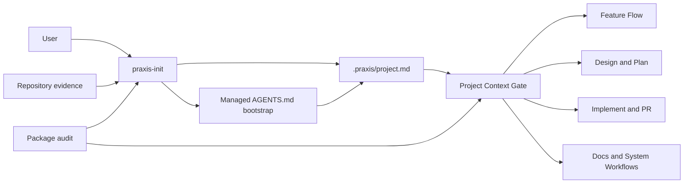
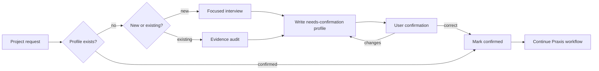
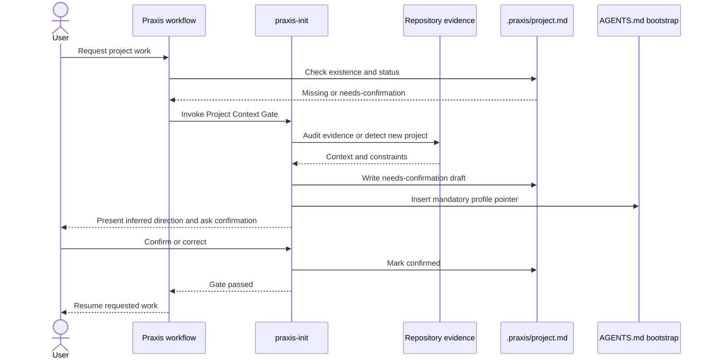
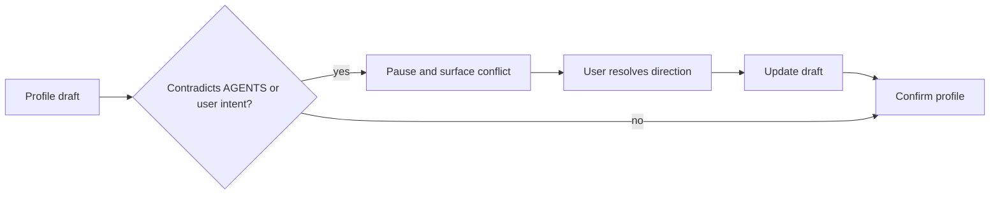

# Diagrams: Mandatory Praxis project context

## Component Diagram

The project profile sits between project evidence/user intent and every project-scoped Praxis workflow.

## Data Flow

## Sequence Diagram

## Error Flow

