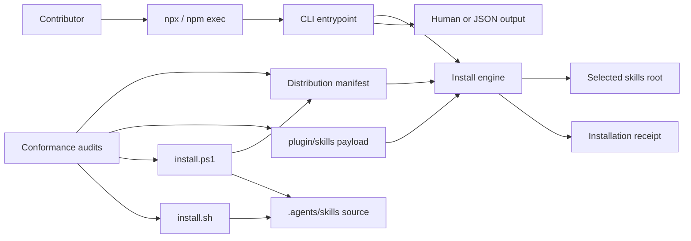
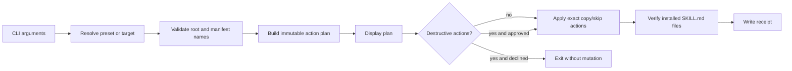
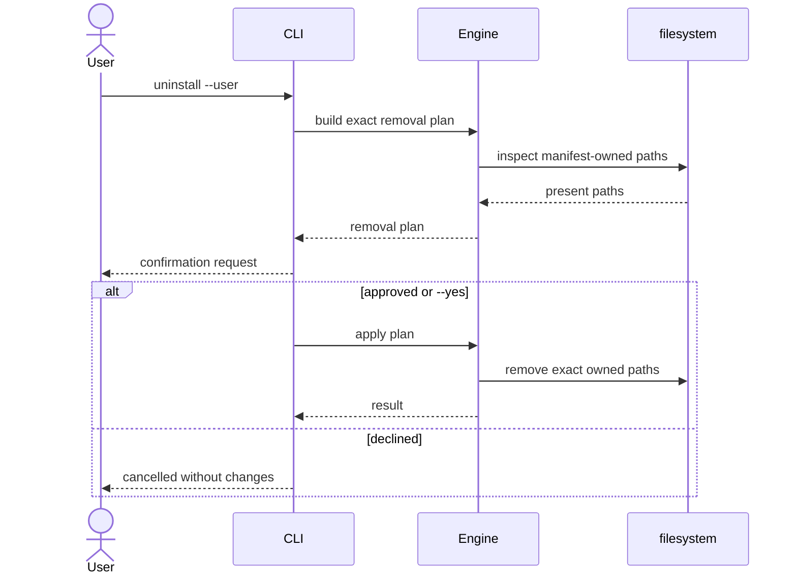

# Diagrams: npx installer

## Component Diagram



## Install Data Flow



## Main Sequence

```mermaid
sequenceDiagram
    actor User
    participant Npx as npm exec
    participant CLI as praxis-skills CLI
    participant Engine as install engine
    participant FS as filesystem

    User->>Npx: npx praxis-skills install --user
    Npx->>CLI: execute cached package binary
    CLI->>Engine: resolve target and build plan
    Engine->>FS: inspect exact destinations
    FS-->>Engine: existing/missing state
    Engine-->>CLI: copy/skip plan
    CLI-->>User: display plan
    CLI->>Engine: apply approved plan
    Engine->>FS: copy payload and write receipt
    FS-->>Engine: completed
    Engine-->>CLI: structured result
    CLI-->>User: installed; invoke $praxis-init
```

## Destructive Operation Sequence


