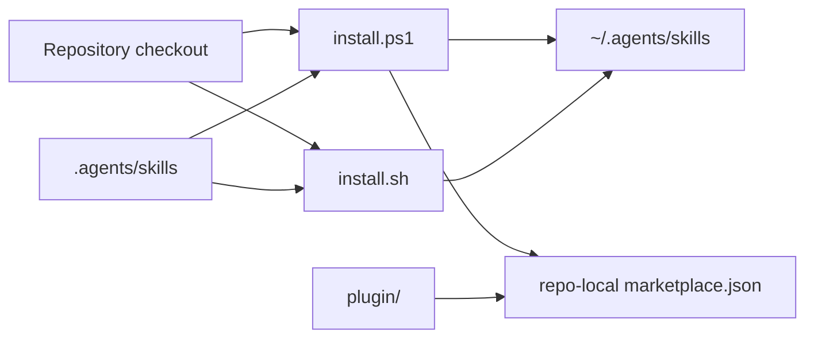

# Research Report: npx installer

## Summary

| Property | Value |
|---|---|
| Type | feature |
| Technology | PowerShell, Bash, Markdown skill packages; no Node package currently |
| Scope | installation scripts, plugin payload, audits, README/install docs, npm release surface |
| Complexity | large |
| Sub-tasks completed | 3/3 inline scans: package, installer, external npm state |

## Components Involved

| Component | Path | Type | Current role | Impact |
|---|---|---|---|---|
| PowerShell installer | `install.ps1` | script | Repo check, user copy, legacy cleanup, local plugin marketplace generation | direct |
| Bash installer | `install.sh` | script | Repo check, user copy, plugin manifest presence check | direct |
| PowerShell uninstaller | `uninstall.ps1` | script | Removes current and legacy user skills and local marketplace entry | direct |
| Package verifier | `verify-install.ps1` | script | Checks required source skills, plugin manifest, and active legacy paths | direct |
| Canonical skills | `.agents/skills/` | payload | 23 repo-local Praxis skill directories | direct |
| Plugin mirror | `plugin/skills/` | payload | npm-suitable non-hidden mirror of the skill tree | direct |
| Plugin manifest | `plugin/.codex-plugin/plugin.json` | metadata | Declares `praxis-skills` version `0.3.0` and MIT license | direct |
| Package audits | `tests/audits/` | verification | 11 PowerShell audits plus aggregate runner | direct |
| User documentation | `README.md`, `docs/how/*` | docs | Clone-based installation and project initialization | direct |

## Data Flow

## External Dependencies

| Service | Type | Current usage | Relevant |
|---|---|---|---|
| npm registry | package registry | No package exists; `npm view praxis-skills` returns 404 | yes |
| npm website | authenticated web session | Chrome session is signed in as `edwyreed` | yes |
| npm CLI | local tool | Node `v22.19.0`, npm `10.9.3`; CLI is not authenticated | yes |
| GitHub | source and release host | Public `EdwyReed/praxis-skills` repository | yes |

## Current Behavior (AS IS)

- Installation requires a repository checkout.
- PowerShell and Bash enumerate skill directories directly from `.agents/skills`.
- Existing destinations are skipped unless `--force` is supplied.
- PowerShell `--force` removes known legacy skill names; Bash replaces only current Praxis targets.
- PowerShell plugin mode writes a repo-local marketplace file pointing to `./plugin`; Bash only checks that the plugin manifest exists.
- There is no `package.json`, package lock, Node CLI, npm tarball contract, GitHub Actions workflow, or root `LICENSE` file.
- The plugin manifest declares MIT, while the repository contains no standalone license text.
- npm web UI reports that account 2FA is disabled.
- `praxis-skills`, `@edwyreed/praxis`, and `@edwyreed/praxis-skills` are not present in the npm registry at the time of research.

## Test Coverage

| Component | Existing coverage | Status |
|---|---|---|
| PowerShell/Bash dry-run | `tests/audits/check-install-dry-run.ps1` | covered |
| Skill and plugin structure | multiple `tests/audits/check-*.ps1` | covered |
| Node CLI | — | no tests; component absent |
| npm tarball contents | — | no tests; component absent |
| npm publishing | — | no workflow; component absent |

## Cross-Cutting Concerns

| Concern | Affected components | Facts |
|---|---|---|
| Filesystem safety | all installers | `--force` and uninstall remove named directories |
| Cross-platform behavior | PowerShell, Bash, future Node CLI | Existing scripts differ in legacy and plugin behavior |
| Supply chain | npm package and release workflow | npx executes a registry-delivered binary; no provenance surface exists yet |
| Package parity | source skills, plugin mirror, npm payload | Current audits verify several mirrors, but no npm tarball exists |
| Authentication | npm publish | Browser is authenticated; CLI is not; account 2FA is disabled |

## Recent Activity

| Scope | Latest change | Commit | Relevance |
|---|---|---|---|
| Whole active package | 2026-07-10 | `ef0cc59` Praxis Skills port merge | Current baseline |
| Legacy installer history | 2026-04 and earlier | pre-port commits | Existing behavior inherited and adapted |

## Risks

| Risk | Description |
|---|---|
| Destructive target selection | A path error could remove unrelated directories during force/uninstall |
| Distribution drift | Three installers and two skill mirrors can diverge without a shared contract and conformance tests |
| Incomplete tarball | npm ignore/default rules can omit hidden or referenced files |
| Unverifiable release | Manual token publishing would not provide the intended trusted-publisher provenance path |
| Name loss | An unregistered package name remains available to other npm publishers |

## Open Questions

- Which account-security path will be used for the first package publication: interactive CLI publish after 2FA, or another npm-supported bootstrap route?
- Should the first public version be a beta prerelease or stable release?
- Which Node engine floor will be declared for the public CLI?
