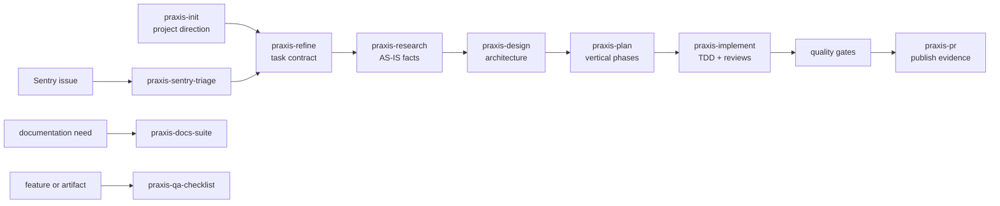

# Praxis Skills

Praxis Skills is a Codex-first, agent-portable, artifact-driven workflow package for taking product and engineering work from an unclear request to a reviewed implementation and pull request.

It provides reusable skills for project initialization, task refinement, codebase research, architecture design, implementation planning, TDD-oriented delivery, review, documentation, QA, Sentry triage, and PR preparation. Every phase produces inspectable files instead of relying on hidden orchestration or conversation memory alone.

Codex is the primary target and the environment in which the maintainer currently develops and verifies Praxis. The core package is intentionally built from Markdown skill contracts, linked references, repository instructions, scripts, and filesystem artifacts rather than a closed runtime API. Agents with compatible skill loading and repository access can likely reuse much of it, but integrations outside Codex are not yet maintained or compatibility-tested by this project.

Praxis is designed to feel disciplined without becoming ceremonial:

- small tasks can use a short path;
- large changes keep explicit research, design, planning, review, and human checkpoints;
- every workflow works inline, with optional subagent support when the environment and user permit it;
- repository instructions and confirmed project direction always outrank Praxis defaults;
- project context remains discoverable even when Praxis itself is not installed.

## Runtime support and portability

Praxis separates its portable workflow knowledge from its primary Codex integration.

| Surface | Portability |
|---|---|
| `SKILL.md` workflows and Markdown references | Agent-portable in principle; require compatible instruction and file loading |
| `.praxis/project.md` and `.praxis/skills.yaml` | Plain repository files that any capable agent can read and validate |
| `.workflows/{feature-id}/` artifacts | Runtime-independent Markdown/JSON evidence and resumable state |
| Validation and audit scripts | Portable where Python, PowerShell, or Bash is available |
| `.agents/skills` discovery | Primary layout used and tested with Codex; other agents may require mapping or copying |
| Root `AGENTS.md` behavior | Tested with Codex; usefulness elsewhere depends on whether the agent honors repository instructions |
| Codex plugin manifest and marketplace entry | Codex-specific distribution surface |
| MCP tool names and optional connectors | Environment-specific and expected to degrade or require adaptation |

Current support policy:

- **Codex:** primary, actively developed, packaged, and verified target.
- **Other skill-capable coding agents:** best-effort portability of the core workflows; installation, discovery, tool names, and orchestration may need adapters.
- **Compatibility claims:** accepted only after real testing in the named agent environment. Similar file formats alone are not treated as proof of support.

Contributions that add another agent runtime should preserve the shared Praxis contracts and isolate runtime-specific packaging instead of forking workflow semantics.

## How the workflow fits together

The complete feature lifecycle is complexity-adaptive. Individual skills can also be invoked independently.



`praxis-feature-flow` coordinates this lifecycle under `.workflows/{feature-id}/`, records phase state, supports resume/status operations, and adjusts ceremony to task complexity:

| Complexity | Typical path |
|---|---|
| Small | Research → Implement → PR, after the user accepts the fast track |
| Medium | Focused research with lighter design, planning, and review |
| Large | Full refinement, research, design, plan, implementation, review, documentation, and PR evidence |

Design artifacts remain human checkpoints. Praxis does not silently move from an inferred design into implementation.

## Project context that survives the session

Repository-scoped Praxis work starts with `$praxis-init`. It establishes two deliberately separate contracts.

### `.praxis/project.md`

The mandatory project profile captures durable direction:

- project concept and intended outcomes;
- product priorities and non-goals;
- desired and prohibited experience qualities;
- one primary visual skill direction when frontend work exists;
- reference sites, designs, and projects with exact links;
- technical, accessibility, legal, operational, and language constraints;
- unresolved questions and explicit confirmation state.

It also selects a Praxis Clear Speech mode:

- `default` applies clear-language rules and the English technical profile where applicable;
- `strict` applies the English technical profile to all eligible English prose;
- `off` disables automatic use and audits.

An explicit request for marketing, creative, literary, legal, academic, brand, or another style takes precedence for that text. A user can still invoke `praxis-clear-speech` for one task when the project mode is `off`. Existing profiles without this field use `default`.

New projects use a focused interview. Existing repositories are audited before the agent asks questions. An inferred profile remains `needs-confirmation`; repository mutations wait until the user confirms it.

To protect the context window, the leading Core Contract is limited to 400 words and the complete profile to 2,500 words. The validator emits a SHA-256 digest, and workflows record the exact profile revision they used.

### `.praxis/skills.yaml`

This optional manifest exists only when contributors need external, nonstandard skill packages to reproduce the project's confirmed workflow or design direction.

It records:

- only `required` or `recommended` packages;
- one package or family per project responsibility;
- selected entrypoint skills rather than an entire local catalog;
- exact source URLs and pinned Git revisions;
- a bounded `applies_when` condition and rationale;
- explicit justification when a project exceeds five required packages.

Praxis never fills this file from a contributor's complete installed-skill inventory. It never installs listed external content automatically. When an applicable dependency is missing, the agent explains the package, source, revision, and reason, then requests explicit approval.

### Root `AGENTS.md` discovery bridge

`praxis-init` adds a small managed block to the repository's root `AGENTS.md`. In Codex, this makes the project profile and optional skill manifest discoverable even when Praxis is unavailable or the session context is heavily loaded. Other agents can use the same files when they honor repository instructions, but that discovery behavior must be verified per runtime. Package details are read only when skill selection, availability, or installation is relevant.

## Included skills

### Delivery workflows

| Skill | Purpose |
|---|---|
| `praxis-init` | Initialize, audit, confirm, or refresh project direction and external skill dependencies |
| `praxis-feature-flow` | Coordinate the complexity-adaptive feature lifecycle and resumable workflow state |
| `praxis-refine` | Turn vague requests into user stories, acceptance criteria, risks, and estimates |
| `praxis-research` | Produce facts-only AS-IS codebase research before proposing changes |
| `praxis-design` | Create architecture, diagrams, ADRs, API contracts, test strategy, and challenge review |
| `praxis-plan` | Decompose design into dependency-aware vertical phases with TDD and verification criteria |
| `praxis-implement` | Implement a planned phase with writer, reviewer, and quality-gate responsibilities |
| `praxis-pr` | Prepare or create a PR using workflow artifacts, review evidence, tests, and CI state |
| `praxis-docs-suite` | Generate or update technical facts, architecture, OpenAPI, feature docs, and indexes |
| `praxis-sentry-triage` | Group Sentry issues into actionable inputs for refinement and feature flow |
| `praxis-qa-checklist` | Generate coverage-driven QA checklists from repository work or standalone artifacts |
| `praxis-system-profile` | Describe actors, use cases, integrations, data flows, issues, and open questions |
| `praxis-skill-from-git` | Extract real repository conventions from Git history into a project-specific skill |
| `praxis-ai-debug` | Inspect package, skill, reference, MCP, installation, and workflow health |
| `praxis-clear-speech` | Write or audit clear replies, technical text, code messages, and interface copy |

## Praxis Clear Speech

Praxis Clear Speech is an independent Praxis policy based on clear technical writing principles from ASD-STE100 Issue 9. Praxis does not bundle the official standard or its controlled dictionary. The policy does not imply ASD approval or certification.

Core rules apply to eligible text in any language. A stricter English Technical Profile adds sentence limits, terminology controls, simple grammar, and structural rules. Protected content includes identifiers, API fields, exact quotations, legal text, trademarks, external contracts, and approved project terms.

Run a structural audit:

```bash
python .agents/skills/praxis-clear-speech/scripts/audit_text.py <path>
```

Use `--sentence-limit 20` for procedures. The default is 25 words for descriptions. Add an authorized approved-word list and project glossary for lexical review. Automated checks do not prove full ASD-STE100 compliance.

See the [initial Praxis skill-text baseline](docs/porting/clear-speech-baseline.md) for current structural findings and review limits.

### Embedded references and templates

| Skill | Purpose |
|---|---|
| `praxis-adr-template` | One-file-per-decision ADR contract |
| `praxis-api-contracts-template` | REST and asynchronous message contract format |
| `praxis-design-template` | Architecture and diagram artifact format |
| `praxis-owasp-top-10` | OWASP Top 10, API security, and modern vulnerability reference |
| `praxis-security-audit-checklist` | Technology-aware security review checklist |
| `praxis-stoplight-docs` | Stoplight/SMD-compatible API documentation guidance |
| `praxis-task-refinement` | INVEST, User Story, Job Story, WWA, estimation, and risk frameworks |
| `praxis-tdd-approach` | Technology-neutral TDD and phase verification contract |
| `praxis-test-design-techniques` | EP, BVA, decision tables, state transitions, pairwise, and error guessing |

## Installation

### Requirements

- a coding agent capable of loading repository skills and files; Codex is the primary tested target;
- Git for repository and history-aware workflows;
- Node.js 22 or newer for the recommended npm installer;
- PowerShell 7 on Windows, or Bash on macOS/Linux, only for checkout-based fallback installation;
- Python 3 for deterministic project-context validation.

Sentry, Context7, and OpenAI documentation MCP servers are optional. The workflows degrade to available tools when those integrations are not configured. See [`docs/how/configure-mcp.md`](docs/how/configure-mcp.md).

### Recommended: npm installer

The current release channel is `beta`. Use the explicit tag so `npx` selects the newest prerelease.

Guided install (recommended on a real terminal):

```bash
npx praxis-skills@beta install
```

Arrow keys, checkboxes, plan preview, confirm. Non-interactive / CI runs without `--agents` still install **Codex only**.

Scripted targets:

```bash
npx praxis-skills@beta install --user
npx praxis-skills@beta install --repo .
```

Multi-agent examples:

```bash
npx praxis-skills@beta detect
npx praxis-skills@beta install --user --agents codex,claude-code
npx praxis-skills@beta install --user --agents claude-code   # skills + /feature-style slash adapters
npx praxis-skills@beta install --repo . --agents cursor,grok
```

Claude Code receives both skill packages under `~/.claude/skills` (or `.claude/skills`) and thin **Praxis-prefixed** slash-command adapters under `commands/` (`/praxis-feature`, `/praxis-init`, `/praxis-research`, …). Prefixing avoids collisions with Claude built-ins such as `/init`. Each adapter loads the matching `praxis-*` skill; workflow logic is not duplicated. Codex skill invocation is unchanged.

The CLI supports `install`, `doctor`, `uninstall`, `detect`, `list`, and `version`. It builds an exact plan from `distribution/manifest.json`, owns only the listed Praxis directories, and preserves unrelated skills. Existing targets are skipped unless `--force` is used. Destructive operations require confirmation or an explicit `--yes`; use `--dry-run` to preview them.

```bash
npx praxis-skills@beta doctor --user --agents codex,claude-code
npx praxis-skills@beta install --user --force --yes
npx praxis-skills@beta uninstall --user --agents claude-code --dry-run
```

Start a new agent session or restart the application after installing or updating skills so the catalog is refreshed.

### Checkout-based fallback

The repository scripts remain available for contributors, offline source checkouts, and environments where Node is unavailable:

```powershell
git clone https://github.com/EdwyReed/praxis-skills.git
cd praxis-skills
pwsh ./install.ps1 --user --force
pwsh ./install.ps1 --repo
pwsh ./verify-install.ps1
```

On macOS or Linux, use `./install.sh --user --force`. In a source checkout, repo mode validates the canonical `.agents/skills` tree; unlike `npx praxis-skills@beta install --repo`, it does not copy skills into another repository.

### Local plugin packaging

The plugin bundle lives under `plugin/`. On Windows, this command checks that the manifest exists and writes a repo-local marketplace entry to `.agents/plugins/marketplace.json`:

```powershell
pwsh ./install.ps1 --plugin
```

The Bash installer validates the plugin bundle but does not generate the Windows marketplace JSON. See [`docs/how/install-as-plugin.md`](docs/how/install-as-plugin.md) for the current local-plugin flow.

All modes support `--dry-run`; compatible modes can be combined:

```powershell
pwsh ./install.ps1 --user --plugin --force --dry-run
```

## First run in a project

Open the target repository in Codex and explicitly invoke the initialization skill:

```text
Use $praxis-init to audit this repository and initialize its Praxis project context.
```

Review the proposed Core Contract, constraints, design routing, references, and external skill dependencies. After correction and confirmation, start a feature flow or invoke only the phase you need:

```text
Use $praxis-feature-flow for the account recovery feature.
Use $praxis-research to trace how report totals are currently calculated.
Use $praxis-design for the approved notification change.
Use $praxis-qa-checklist for this feature specification.
```

In Codex, Praxis skills are normal skills rather than legacy slash commands. Natural-language invocation is supported, but naming the skill explicitly is useful when starting a workflow or handing work to another contributor. In another agent runtime, use that platform's equivalent skill invocation or load the relevant `SKILL.md` directly.

## Frontend and design-skill routing

Praxis does not impose one visual style and does not activate several competing art-direction skills at once.

For visually significant work, the confirmed project profile selects exactly one primary visual skill. Repository rules and explicit user direction take precedence. React, shadcn, accessibility, performance, testing, and browser QA skills can supplement that direction because they own narrower technical responsibilities.

TasteSkill-family skills are not bundled with Praxis. A project can prefer one through `.praxis/project.md` and record its reproducible source in `.praxis/skills.yaml`. If the exact applicable skill is unavailable, the agent asks before installing it.

See [`references/rules/frontend-skill-routing.md`](references/rules/frontend-skill-routing.md) for the complete routing contract.

## Repository structure

| Path | Role |
|---|---|
| `AGENTS.md` | Compact, always-on repository guidance and project-context discovery |
| `.praxis/` | Confirmed project direction and optional external skill dependencies |
| `.agents/skills/` | Canonical repo-local Praxis skill packages |
| `.workflows/{feature-id}/` | Refinement, research, design, plan, implementation, and review evidence |
| `references/` | Shared roles, rules, contexts, scenarios, templates, and historical source docs |
| `plugin/` | Installable Codex plugin mirror and manifest |
| `distribution/manifest.json` | Exact npm payload, version, current skills, legacy names, and receipt contract |
| `bin/` and `lib/` | Zero-dependency cross-platform npm installer CLI |
| `docs/` | Installation, migration, architecture, and packaging documentation |
| `tests/audits/` | Naming, parity, reference, routing, context, manifest, and install checks |
| `install.ps1` / `install.sh` | Repo, user, and plugin setup surfaces |

The plugin and repo-local skill trees intentionally mirror one another. Workflow skills embed the references they need so user-global and plugin installs do not depend on files left behind in the source checkout.

## Verification

Run the complete package audit before publishing changes:

```powershell
node --version
npm test
npm run pack:check
pwsh ./tests/audits/run-all.ps1
```

The suite verifies:

- required source coverage and `praxis-*` naming;
- skill frontmatter and internal reference links;
- repo/plugin parity and manifest integrity;
- project-context and skill-dependency contracts;
- frontend routing synchronization;
- absence of active Claude-only surfaces;
- install and uninstall dry-run behavior.

For a quick package sanity check:

```powershell
pwsh ./verify-install.ps1
```

## Updating and uninstalling

Update a user installation:

```bash
npx praxis-skills@beta install --user --force --yes
```

Preview removal:

```bash
npx praxis-skills@beta uninstall --user --dry-run
```

Remove npm-installed user-global Praxis skills:

```bash
npx praxis-skills@beta uninstall --user --yes
```

The checkout-based `uninstall.ps1` remains available for local plugin marketplace entries. Both paths target only current Praxis directories, known legacy package names, and their own generated metadata.

## Migration and further documentation

This repository began as a Codex-native port of the original Claude Code workflow package preserved in the pre-port `master` history. Its maintained distribution remains Codex-first, while the workflow core is kept as agent-portable as practical. The active Codex surfaces do not depend on Claude Code home directories or slash-command conventions.

- [Install guide](docs/how/install.md)
- [Migrate from Claude Code](docs/how/migrate-from-claude-code.md)
- [Codex-native architecture](docs/porting/codex-architecture.md)
- [Surface decisions](docs/porting/surface-decisions.md)
- [Coverage matrix](docs/porting/coverage-matrix.md)
- [Plugin release checklist](docs/porting/plugin-release-checklist.md)
- [Contributing](CONTRIBUTING.md)

Contributions should keep repo-local, plugin, and user-global behavior aligned. Run the complete audit suite before opening a release or pull request.
